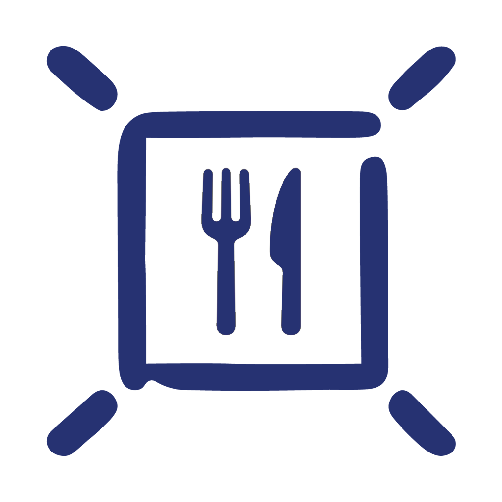

# mensa-bar


MensaBar is a simple MacOS menu bar app that shows the current menu of Studentenwerk Leipzig cafeterias.

## Showcase


## Note

```
🙏 Please note that this app is technically not even in alpha. It is currently undergoing development.
```
